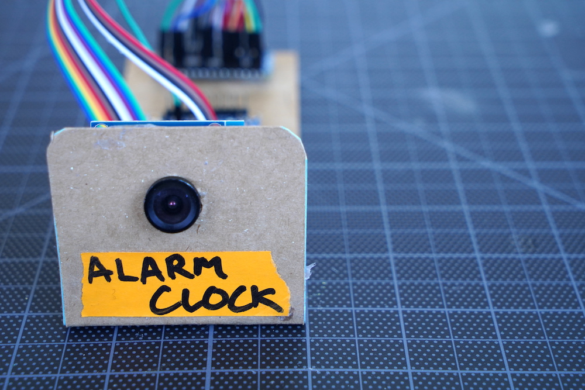

# Morning Mountain: Visual Alarm Clock
#### Get up in the morning by striking a pose to stop your alarm from ringing.

##### **Overview** 

Since 2009, coders have created thousands of experiments using Chrome, Android, AI, WebVR, AR and more. We showcase these projects and a variety of helpful tools and resources to inspire a diverse community of makers to explore, create, and share what’s possible with these technologies.

**Morning Mountain** Using an Arduino, OV7670 Camera, and Teachable Machine, you can train a tiny machine learning model to recognize your custom pose.

This project is a part of a collection of experiments that show the possibilities of building with TensorFlow Lite for Microcontrollers.

These projects were built with [TensorFlow Lite for Microcontrollers](https://www.tensorflow.org/lite/microcontrollers "TFL4M") and [Teachable Machine](https://teachablemachine.withgoogle.com)

----

##### **Experiment description**

- [Morning Mountain](https://experiments.withgoogle.com/visual-alarm-clock "Morning Mountain Google Experiment") lets you stop your alarm clock from ringing by striking a pose.
Other experiments to explore:

- [Air Snare](https://experiments.withgoogle.com/air-snare "Air Snare Google Experiment") lets you play the drums in the air.
- [Astrowand](https://experiments.withgoogle.com/astrowand "Astrowand Google Experiment") lets you draw shapes in the air to form constellations.
- [Finger User Interface](https://experiments.withgoogle.com/finger-user-interface "FUI Google Experiment") or FUI (pronounced Foo-ey) lets you control connected devices with the wave of a finger.
- [Tiny Motion Trainer](https://experiments.withgoogle.com/tiny-motion-trainer "Tiny Motion Trainer") lets you train and test IMU based TFLite models in the browser.

----

##### **Tools**
- Linux, MacOS or Windows computer with Chrome installed
- Arduino Nano BLE Sense 33
- Micro USB cable (If you're on a USB-C laptop, instead get a USB-C to Micro USB cable)
- [OV7670](https://www.amazon.com/HiLetgo-OV7670-640x480-0-3Mega-Arduino/dp/B07S66Y3ZQ/ref=sr_1_2?crid=1YF58RNGCDZBG&dchild=1&keywords=ov7670+camera+module&qid=1622134304&sprefix=ov767%2Caps%2C247&sr=8-2)
- [Audio FX Mini Sound Board](https://www.adafruit.com/product/2342)
- [PAM8320A 2.5w Amplifier](https://www.adafruit.com/product/2130)
- [Mini Speaker](https://www.adafruit.com/product/1890)
- [Female/Female Jumper Wires](https://www.adafruit.com/product/1950)
- Thin cardboard - We used a cereal box 🥣!
- Glue - We used hot glue
- Craft knife to cut the cardboard
- Soldering iron

----

##### **Install and Run**

[View the full installation instructions in the Morning Mountain guide here.](https://experiments.withgoogle.com/visual-alarm-clock)

----

##### **Using the TensorFlow Microcontroller Challenge Kit by Spark Fun**
 
The board that comes with the TensorFlow Microcontroller Challenge Kit by Spark Fun comes preflashed with a sketch that will work with some of the experiments right out of the box. If you are using one of the “TensorFlow Micro Challenge” kits and you just want to jump right into playing with the experiments then you can simply connect your Arduino to a power source (USB or Battery) and connect to one of the following experiment URLs:
- [Air Snare](https://experiments.withgoogle.com/air-snare/view "Air Snare")
- [Finger User Interface (FUI)](https://experiments.withgoogle.com/finger-user-interface/view "FUI")

----

##### **FAQ & Common Errors**

**What if I’m having issues connecting via bluetooth?**
If you are having issues connecting try the following: 
1. Make sure your browser (Chrome or Edge) supports Bluetooth and it is enabled. . 
2. Make sure your device (laptop, phone, etc) supports Bluetooth and that it is working and enabled..
3. Refresh the web page,unplug the Arduino power cable and then plug it back in to reset.  , then try connecting again.

*NOTE: If you’re using a managed device, like a computer from school or work, your device policy may prevent BLE pairing.*

**My board isn’t showing up on my computer, even though it’s plugged in. What should I do?**
Try unplugging the Arduino power cable and then plug it back in to reset.

**The model isn’t getting my power pose right. What do I do?**
Remember that the results of any machine learning model depend on the examples you give it. Trying different examples is a core part of exploring machine learning. So, if the model from teachable machine is not working as you intended, play around with different approaches for what examples you provide.

**Do you have plans to support other boards?**
We made these projects to work specifically with the Arduino Nano, and we currently don’t have plans to expand support. However, all of the code is open sourced, so you can remix or modify as needed. 

**Where should I go from here if I want to make my own model or project?**
You can create your own model in several different ways. Check out these links: 
- Experiments Collection - Inspiration and more resources
- Tiny Motion Trainer - Code-free motion trainer for microcontrollers
- Teachable Machine - Code-free image model trainer
- [TensorFlow Lite for Microcontrollers](https://tiny-motion-trainer-dot-gweb-tf-micro-exp.uc.r.appspot.com/ "TensorFlow Lite for Microcontrollers") - Full documentation 
- [Free Harvard EdX Course](https://www.edx.org/professional-certificate/harvardx-tiny-machine-learning "Harvard X Course")  - In-depth course on TensorFlow Lite for Microcontrollers and the TinyML Ecosystem

**"What sensors does this experiment use?"**
The camera is the OV7670. It's a 0.3 megapixel color camera, that interfaces with the Arduino over I2C. [Read more here](https://www.openhacks.com/uploadsproductos/ov7670_cmos_camera_module_revc_ds.pdf)

**How do you shrink a TensorFlow model to fit on a microcontroller?**
Post-training quantization is a conversion technique that can reduce model size while also improving CPU and hardware accelerator latency, with little degradation in model accuracy. You can quantize an already-trained float TensorFlow model when you convert it to TensorFlow Lite format using the TensorFlow Lite Converter. Read more here: https://www.tensorflow.org/lite/performance/post_training_quantization

----

##### **Note**

This is not an official Google product, but a collection of experiments that were developed at the Google Creative Lab. This is not a library or code repository that intends to evolve. Instead, it is a snapshot alluding to what’s possible at this moment in time.

We encourage open sourcing projects as a way of learning from each other. Please respect our and other creators’ rights, including copyright and trademark rights when present, when sharing these works and creating derivative work. If you want more info on Google's policy, you can find that [here.](https://about.google/brand-resource-center/ "Google Brand Resource Center")

----

